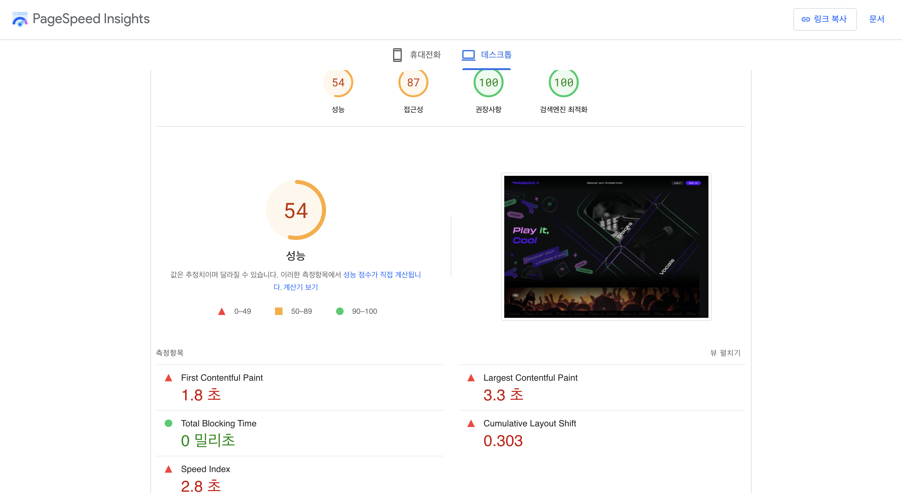

# 💻 웹 최적화에 대하여

Track 1의 릴리즈를 코앞에 두고 QA를 거듭하면서, 항상 동일하게 나오는 이슈가 하나 있다. 바로 로딩문제다. 기획자들은 항상 달려와서 '이거 업로드가 안돼요!', '이거 왜 두 번 세 번씩 업로드되어요?'라고 말하는데, 그 때마다 우리는 항상 같은 말을 반복해왔다. '제발 3초만 기다려줘요...두 번 세 번 클릭하지 말고 제발 딱 3초만 기다리면 잘 업로드되어요...' 그리고 반문한다. '어떻게 하면 최적화를 할 수 있을까?' 그 전에 웹 최적화가 무엇인지에 대해 먼저 알아보자. 
<br/><br/>

> ## 1️⃣ 웹 최적화는 무엇일까?
웹 최적화란 '브라우저가 네트워크와 통신하는 과정은 물론 브라우저에서 페이지를 표시하는 과정에서의 응답 속도를 개선하는 것'이라고 한다. 쉽게 말해서 '로딩 시간이 짧도록 개선하는 것'이라 할 수 있다. 아무리 잘 만들어진 서비스더라도 사람들의 마음에 남지 않으면 쉽게 잊혀지기에 모든 서비스에게 사용자 경험은 너무나도 중요한 키포인트이다. 결국 웹의 성능은 사용자 경험에서 비롯되고, 아무리 좋은 성능이라고 해도 유저가 불편하다고 말한다면 불편한 성능이 되는 것이다. 개발자의 입장에서 Track 1을 바라보았을 때에는 제발 3초만 기다려달라는 마음이지만, 뼛속까지 급한 코리안인 나도 다른 서비스를 이용할 때, 화면이 바로바로 뜨지 않는다면 곧바로 이탈해버리곤 했다. 

즉, 웹 최적화란 '사용자가 사용하기 편리할 만큼 응답 속도를 빠르게 개선하는 것'이라고 할 수 있다. 그렇다면 실질적으로 최적화가 필요한 이유는 무엇일끼?
<br/><br/>

> ## 2️⃣ 최적화가 필요한 이유는 무엇일까?
최적화가 필요한 이유는 앞서 이야기했던 내용의 연장선이다. 바로 '유저 이탈률을 줄이기 위해서'.
<br/>

```
0.1초 사용자의 동작에 해당 기능이 바로 반응한다고 느끼는 시간

1초 불필요하게 오래 기다리지 않았다고 느끼는 시간, 0.2~1초의 시간은 컴퓨터가 동작하는 시간으로 이해될수 있는 시간. 시간이 1초 이상 걸리면 컴퓨터의 동작에 이상이 생겼다고 생각하게 됨.

10초 사용자가 집중력을 잃지 않는 최대 시간
```

위의 내용은 사용자가 느끼는 웹 페이지 반응속도이다. 유저들은 정말 즉각적인 반응 속도를 편해하지만 즉각적이지 않은 경우 바로 불편함을 느낀다. 실제로 구글에서 반응 속도에 따른 사용자 사용 경험에 대한 조사를 진행했는데 페이지가 3초 안에 로딩되지 않으면 무려 53%의 사용자가 해당 웹 페이지를 이탈했다고 한다. 이 조사를 통해 '3초의 법칙'이라는 말이 생겨났다고 한다. 즉, 3초 이내에 로딩이 되지 않는다면, 3초 이내로 응답하도록 최적화되지 않는다면 유저는 곧바로 이탈하고 우리 서비스는 '너무 느려서 쓰기 싫은 서비스'로 전락하고 말 것이다. 느리고 불편한 서비스라는 첫인상을 갖게 되면 유저는 우리 서비스로 다시는 돌아오지 않지 않을까?

<br/>

그렇다면 지난 석 달 남짓한 시간동안 열심히 개발한 Track 1의 성능점수는 어떨까? 구글 PageSpeed Insights에서 성능 점수를 확인해볼 수 있다. 

```
- FCP (First Contentful Paint) : 첫 번째 텍스트 또는 이미지가 표시되는 데 걸린 시간
- TTI (Time to Interactive) : 사용자와 페이지가 상호작용할 수 있게 된 시간
- SI (Speed Index) : 페이지 콘텐츠가 얼마나 빨리 표시되는지에 대한 정보
- TBT (Total Blocking Time) : FCP와 TTI 사이 모든 시간의 합. 작업 지속 시간이 50ms를 초과하면 밀리초 단위로 표현됨
- LCP (Largest Contentful Paint) : 가장 큰 텍스트 또는 이미지가 표시된 시간
- CLS (Cumulative Layout Shift) : 표시 영역 안에 보이는 요소들이 얼마나 이동하는지에 대한 정보
```
업로드하는데 3초가 걸려서 우려했던 것과는 달리 꽤 괜찮은 성능점수가 나왔다. post를 제외한 get, update, delete는 1초만에 이루어지는 서비스이기 때문에 잘 나온 게 아닐까 싶기도 하다. 

<br/><br/>

> ## 3️⃣ 이를 위해 어떤 개발을 해야 할까?
최적화가 중요한 것은 알겠지만, 실질적으로 어떤 개발을 해야하는 것일까? 사실 Track 1을 개발할 때 가장 많이 되뇌인 질문이다. 로딩 빨리되는 거 중요하지, 최적화 정말 중요하지. 그래서 그거 어떻게 하는 건데? 

<br/>
데이터를 관리하는 것은 서버지만, 그 데이터를 가공하는 것은 클라이언트의 몫이기 때문에, 어떻게 최적화를 할 수 있는지에 대한 이야기는 프론트엔드 개발자를 꿈꾸는 나에겐 정말 중요한 이슈다. 

<br/>
브라우저는 상단부터 차례대로 로드되기 때문에, HTML파일을 위에서부터 차근차근 읽어들인다. 이를 기억하고 어떤 점을 개선하면 좋을지 함께 알아보자. 

<br/>

### 1 css
가장 먼저 css에 대한 내용이다. 

위의 사진은 브라우저의 스타일이 그려지는 순서이다. 만약 레이아웃의 넓이, 높이, 위치 등에 영향을 주는 css 속성이 변경됨을 감지하면, 브라우저는 레이아웃으로 돌아가, 레이아웃을 다시 그리기 시작한다. 이를 '리플로우'라고 한다. 리플로우가 일어나면, 브라우저가 전체 픽셀을 다시 계산해야하는 과정이 발생하기 때문에 되도록 리플로우가 일어나지 않도록 하는 것이 좋다.ㅣ 


하지만 레이아웃에 영향을 주지 않는 속성을 변경하게 되면, 레이아웃 과정을 건너뛰게 되고, 이를 '리페인트'라고 한다. 

리플로우(Reflow)를 발생시키는 속성
```
position / width / height / margin / padding / display / top / left / right / bottom / 
box-sizing / border-color / text-align / border / border-width / 
font-family / float / font-size / font-weight / line-height / vertical-align / 
white-space / word-wrap / text-overflow / text-shadow ...
```

리페인트(Repaint)를 발생시키는 속성
```
color / border-style / visibility / background / background-color / 
background-image / background-position / background-repeat / background-size / 
text-decoration / outline / outline-style / outline-color / outline-width / 
border-radius / box-shadow ...
```

리플로우와 리페인트를 발생시키지 않는 속성
```
opacity / transform / cursor / z-index ...
```

개발을 하면서 웬만하면 position:aboslute를 쓰지 않아야한다는 말을 꽤 많이 들었는데, 그 이유도 여기있는 것 같다. 매번 모든 곳의 픽셀을 다시 지정해주면 그만큼 속도가 느려질 수밖에 없다. 

<br/>
뿐만 아니라, 사용하지 않는 스타일이 많으면 그 또한 성능에 영향을 미치기 때문에 사용하지 않는 css속성은 삭제해주는 것이 좋다. 

<br/>

### 2 html
html 또한 복잡하지 않도록 짜는 것이 중요하다. 인라인 스타일을 사용하면 스타일이 중복될 가능성이 있고, 인라인 스타일을 사용하면 추가적인 리플로우를 발생시키기 때문에 사용하지 않는 것이 좋다. 

<br/>
html 코드를 짜다 보면 정말 복잡한 구조를 얻게 되기도 한다. div 안에 div, 또 그 안에 div... 이렇게 깊어질 수록 html의 DOM트리는 점점 커지게 되는데, DOM이 깊고 크면 그만큼 계산이 복잡해지기 때문에 불필요하게 태그를 더 감싸지 않는 것이 좋다. 뿐만 아니라, 만일 DOM트리의 상위 노드를 변경하면 하위 노드에 모두 영향을 미치기 때문에, 되도록 변경 범위를 최소화하여 레이아웃을 최소화하는 것이 좋다. 

<br/>

### 3 js
앞서 이야기했듯 DOM의 속성이 변경되면 레이아웃이 일어난다. 그리고, 특정 속성에서 가장 최신을 값을 확인하기 위해 이 레이아웃이 동기적으로 발생하는 현상을 강제 동기 레이아웃이라고 한다. 이렇게 레이아웃이 늘어나게 되면 실행시간이 늘어나기 떄문에 주의해야한다. 

```
function resizeAllParagraphs() {
  const box = document.getElementById('box');
  const paragraphs = document.querySelectorAll('.paragraph');

  for (let i = 0; i < paragraphs.length; i += 1) {
    paragraphs[i].style.width = box.offsetWidth + 'px';
  }
}
// 레이아웃 스래싱을 개선한 코드
function resizeAllParagraphs() {
  const box = document.getElementById('box');
  const paragraphs = document.querySelectorAll('.paragraph');
  const width = box.offsetWidth;

  for (let i = 0; i < paragraphs.length; i += 1) {
    paragraphs[i].style.width = width + 'px';
  }
}
```
위이 코드를 보면 첫번째 함수는 for문 안에서 매번 offsetWidth을 불러오고 있다. 그렇게 되면 for문이 실행될 때마다 레이아웃이 발생하게 된다. 이를 레이아웃 스레싱이라고 한다. 그와 달리 아래의 코드는 for 문 밖에서 미리 offsetWidth를 구해두고 시작하기 때문에 레이아웃 스레싱이 개선된 코드이다. 이처럼 레이아웃 스레싱이 일어나지 않도록 최대한 노력하는 것이 중요하다. 

<br/>


### 4 로딩 최적화
css로 처리할 수 있는 이벤트는 js로 처리하는 것이 좋다. css로도 간단한 호버나 클릭 이벤트는 처리할 수 있기 때문에 불필요한 자바스크립트 코드를 줄이는 것이 좋다. 또한 css를 상단에, js를 하단에 불러와서, js를 제외한 모든 구조들의 로드가 끝나고 시작되는 것이 좋다. 만일 html, css, js가 동시에 파싱되면 html이 파싱을 멈추고, script를 먼저 수행하기 때문이다.  

<br/>
@media 속성을 이용하는 것도 중요하다. @media를 사용하면 화면마다 조건별 css를 불러올 수 있기 때문에 @meda에 해당하지 않는 곳은 스타일을 불러오지 않는다. 

<br/>
이밖에도 최적화를 수행할 수 있는 부분은 정말 많다. 스크립트 압축, SEO, page prefetching 등이 있으며, 백엔드 단에서도 수행할 수 있는 최정화의 종류는 정말 다양하다. 

<br/><br/>

> ## 4️⃣ 최적화를 위한 개발을 꼭 해야 할까?
'개발자는 개발만 잘하면 되지~'라는 말은 정말 잘못된 말이라고 생각한다. 각자마다 다르겠지만, 나는 개발자가 가져야할 소양 중 '능동성'이 가장 중요하다고 생각한다. 수동적으로 개발하는 것이 아니라, 기획자가, 디자이너가 어떻게 생각했기에 이런 결과물이 나왔을까, 사용자에게 이러한 이벤트나 뎁스가 불편하지는 않을까 끊임없이 생각하는 것 말이다. 최적화는 이러한 끊임없이 생각 끝에 항상 '그렇다'라는 대답이 돌아올 수밖에 없는 과제이다. 최적화를 위한 개발은 곧 사용자의 사용경험을 생각하는 개발이기에, 누군가에게 사랑받는 서비스를 만들기 위해서는 반드시 최적화를 위한 개발을 해야한다고 생각한다. 

<br/>
Track 1을 보면 아직은 사용자 최적화가 완벽하게 이루어지지는 않은 듯하다. 급한대로 업로드나 업데이트 때 로딩 화면을 추가해서, 사용자에게 컴퓨터가 동작하고 있다는 것을 보여주기는 하지만 사용자가 원하는 0.1초만의 즉각적인 반응을 기대하기엔 아직 무리가 있다. 아무래도 용량이 큰 음악파일을 함께 업로드하다보니 최적화를 하는 것이 쉽지만은 않은 듯 하다. 하지만 결국 우리 서비스가 끝까지 사랑받으려면 단 한 명도 불편한 사람이 없도록 계속해서 최적화를 해나가려고 한다. 

<br/>
그리고 최적화 방법이 이렇게나 많을 줄 몰랐다...
더 공부해보아야겠다.

<br/><br/>

>## 📚 참고자료
[웹 개발자가 생각해야하는 웹 성능 최적화](https://ssdragon.tistory.com/131)

[웹 사이트 최적화](https://12bme.tistory.com/127)

[웹 성능 최적와 방법](https://velog.io/@hsecode/%EC%B5%9C%EC%A0%81%ED%99%94-%EC%9B%B9-%EC%84%B1%EB%8A%A5-%EC%B5%9C%EC%A0%81%ED%99%94-%EB%B0%A9%EB%B2%95-5%EB%B6%84-%EC%99%84%EC%84%B1)

[레이아웃 최적화](https://ui.toast.com/fe-guide/ko_PERFORMANCE#%EA%B0%95%EC%A0%9C-%EB%8F%99%EA%B8%B0-%EB%A0%88%EC%9D%B4%EC%95%84%EC%9B%83-%EC%B5%9C%EC%A0%81%ED%99%94)